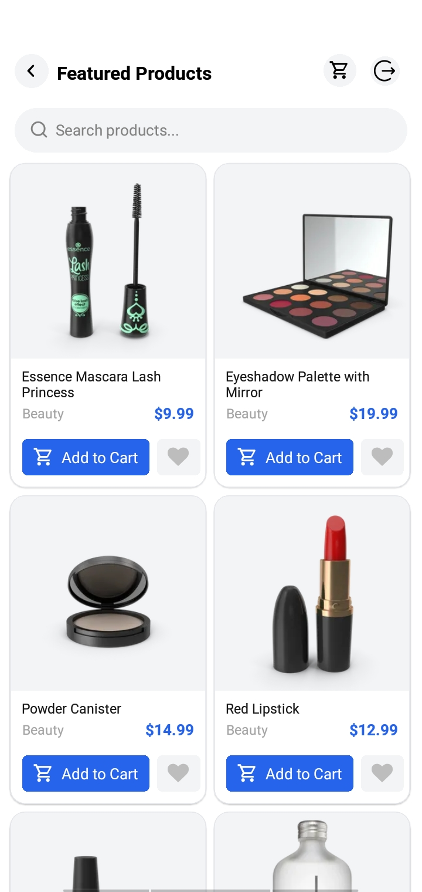
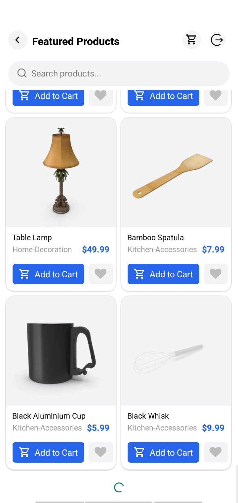
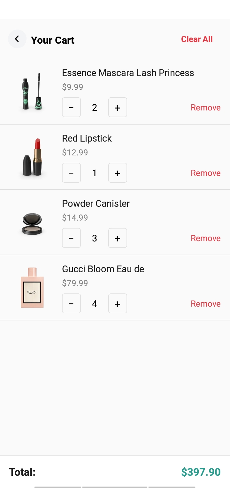

# 🛒 React Native Shopping App

A simple yet functional shopping app built using **React Native**, demonstrating clean architecture, state management, local database integration, and smooth user experience across screens.

## ✅ Features Implemented

- 🔐 **Authentication Flow**  
  - Login functionality with `AuthContext`  
  - Global state management using `React Context API`

- 🧭 **Navigation**  
  - Seamless screen transitions using `react-navigation`

- 🛍️ **Product List Screen**  
  - Infinite scrolling (paginated) product list  
  - Smooth, responsive layout and performance-optimized FlatList

- 📦 **Product Details Screen**  
  - Displays full product info  
  - Self-scrolling image carousel with animation for product thumbnails

- 🛒 **Cart Management**  
  - Local cart storage using **SQLite**  
  - Add, update, and remove items from cart  
  - Persistent across app reloads

- ⚙️ **State Management**  
  - Global app state handled using `Redux`  
  - Separation of concerns with dedicated slices (e.g., for cart)

- 🌐 **Network Layer**  
  - Built a clean request controller using the `fetch` API  
  - Centralized error handling and headers logic

- 🎨 **UI/UX**  
  - Consistent, minimalist design across all screens  

---

## 🔧 Tech Stack

- React Native (with TypeScript)
- React Navigation
- Redux Toolkit
- SQLite
- Context API for Auth
- Fetch API for networking

---

## 📦 Upcoming Features

- 📴 **Offline-First Support**  
  - Complete local-first data handling with cache fallback

- 💾 **Liked Products**  
  - Add to favorites/likes using SQLite

- 🔃 **Data Sync**  
  - Smart syncing with remote server when online

- 🧪 **Unit Tests**  
  - Adding tests with `Jest`

---

## 📸 Screenshots

<table>
  <tr>
    <td></td>
    <td></td>
    <td></td>
  </tr>
   <tr>
    <td></td>
    <td></td>
</tr>
</table>

---

## 🚀 Getting Started

```bash
git clone https://github.com/BrijeshNenwani/OutPlay.git
cd OutPlay
npm install

# Make sure you've installed and you're logged into eas. then run:
eas build --platform android --profile preview

```
download from the provided link when ready and install it on your android phones

Regards,
Brijesh
